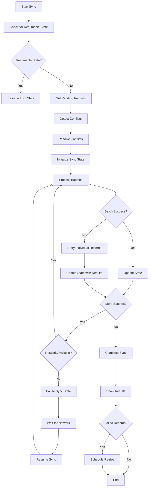

# Sync Error Handling and Retry Mechanisms

This document describes the enhanced error handling and retry mechanisms implemented for the attendance sync system.

## Overview

The sync error handling system provides comprehensive error management, automatic retry with exponential backoff, sync state persistence for network interruption recovery, conflict resolution for duplicate records, and user-friendly notifications.

## Components

### 1. SyncErrorHandler (`errorHandler.ts`)

Handles error classification, retry logic, and user feedback.

#### Features:
- **Error Classification**: Automatically classifies errors into types (network, server, authentication, etc.)
- **Retry Logic**: Implements exponential backoff with jitter for retryable errors
- **Error Logging**: Comprehensive error logging with metadata
- **User Messages**: Provides user-friendly error messages and suggested actions

#### Usage:
```typescript
import { syncErrorHandler } from './errorHandler';

// Create sync error
const syncError = syncErrorHandler.createSyncError(recordId, error);

// Check if retryable
if (syncErrorHandler.shouldRetry(syncError)) {
    const retryDelay = syncErrorHandler.calculateRetryDelay(syncError.retryCount);
    // Schedule retry
}

// Get user-friendly message
const message = syncErrorHandler.getUserFriendlyMessage(syncError);
const actions = syncErrorHandler.getSuggestedActions(syncError);
```

### 2. SyncStateManager (`syncStateManager.ts`)

Manages sync state persistence for recovery from network interruptions.

#### Features:
- **State Persistence**: Saves sync progress to survive app restarts and network interruptions
- **Batch Tracking**: Tracks individual batch progress for granular recovery
- **Resume Logic**: Automatically resumes interrupted sync operations
- **Recovery Information**: Provides detailed recovery status for user display

#### Usage:
```typescript
import { syncStateManager } from './syncStateManager';

// Initialize sync state
const syncState = await syncStateManager.initializeSyncState(records, batchSize);

// Update progress
await syncStateManager.updateSyncProgress(batchIndex, successful, failed, errors);

// Pause on interruption
await syncStateManager.pauseSync();

// Resume when network restored
const resumedState = await syncStateManager.resumeSync();
```

### 3. ConflictResolver (`conflictResolver.ts`)

Handles conflict detection and resolution for duplicate attendance records.

#### Features:
- **Conflict Detection**: Identifies various types of conflicts (duplicates, status conflicts, etc.)
- **Resolution Strategies**: Multiple strategies for resolving different conflict types
- **Automatic Resolution**: Resolves conflicts automatically using predefined rules
- **Conflict Reporting**: Provides detailed information about resolved conflicts

#### Conflict Types:
- `DUPLICATE_RECORD`: Exact duplicate records
- `TIMESTAMP_CONFLICT`: Records too close in time
- `STATUS_CONFLICT`: Different attendance status for same student/day
- `METHOD_CONFLICT`: Different capture methods (ML vs manual)

#### Resolution Strategies:
- `KEEP_LATEST`: Keep the most recent record
- `KEEP_EARLIEST`: Keep the earliest record
- `PREFER_ML_CAPTURE`: Prefer ML-captured records over manual
- `PREFER_PRESENT_STATUS`: Prefer present status over absent
- `MERGE_RECORDS`: Merge compatible records

#### Usage:
```typescript
import { conflictResolver } from './conflictResolver';

// Detect conflicts
const conflictResult = conflictResolver.detectConflicts(records);

if (conflictResult.hasConflicts) {
    // Resolve conflicts
    const resolutions = conflictResolver.resolveConflicts(conflictResult.conflicts);
    
    // Process resolved records
    for (const resolution of resolutions) {
        // Use resolution.resolvedRecord
        // Handle resolution.discardedRecords
    }
}
```

### 4. NotificationService (`notificationService.ts`)

Provides comprehensive user notifications for sync operations.

#### Features:
- **Error Notifications**: User-friendly error messages with suggested actions
- **Progress Notifications**: Real-time sync progress with percentage completion
- **Success Notifications**: Confirmation messages for successful operations
- **Network Status**: Offline/online status indicators
- **Retry Notifications**: Information about automatic retry attempts

#### Notification Types:
- `SUCCESS`: Successful operations
- `ERROR`: Error conditions with actions
- `WARNING`: Warning conditions (e.g., offline mode)
- `INFO`: Informational messages
- `SYNC_PROGRESS`: Real-time progress updates
- `NETWORK_STATUS`: Network connectivity status

#### Usage:
```typescript
import { notificationService } from './notificationService';

// Show error notification
notificationService.showSyncError(syncError, recordCount);

// Show progress
notificationService.showSyncProgress({
    totalRecords: 100,
    processedRecords: 50,
    percentage: 50,
    currentOperation: 'Processing batch 1',
    isComplete: false
});

// Show success
notificationService.showSyncSuccess(syncResult);
```

## Enhanced Sync Service Integration

The existing `SyncService` has been enhanced to integrate all error handling components:

### Key Enhancements:

1. **Automatic Conflict Resolution**: Detects and resolves conflicts before syncing
2. **State Persistence**: Saves sync state for interruption recovery
3. **Exponential Backoff**: Implements retry logic with exponential backoff
4. **Individual Record Retry**: Retries individual records when batch fails
5. **Comprehensive Notifications**: Provides real-time user feedback
6. **Network Interruption Handling**: Gracefully handles network loss and recovery

### Error Handling Flow:



## Error Types and Handling

### Network Errors
- **Detection**: Connection timeouts, network unavailable
- **Handling**: Exponential backoff retry, state persistence
- **User Feedback**: Offline mode notification, retry scheduling

### Server Errors (5xx)
- **Detection**: HTTP 500-599 status codes
- **Handling**: Exponential backoff retry
- **User Feedback**: Server unavailable message, automatic retry notification

### Authentication Errors (401/403)
- **Detection**: HTTP 401/403 status codes
- **Handling**: No retry, require re-authentication
- **User Feedback**: Login required notification

### Validation Errors (4xx)
- **Detection**: HTTP 400-499 status codes (except auth)
- **Handling**: No retry, log for debugging
- **User Feedback**: Data validation error message

### Conflict Errors
- **Detection**: Duplicate records, status conflicts
- **Handling**: Automatic conflict resolution
- **User Feedback**: Conflict resolution notification

## Configuration

### Retry Configuration:
```typescript
const retryConfig = {
    maxRetries: 5,
    baseDelay: 1000, // 1 second
    maxDelay: 300000, // 5 minutes
    multiplier: 2,
    jitterPercent: 0.1 // 10% jitter
};
```

### Sync Configuration:
```typescript
const syncConfig = {
    batchSize: 50,
    maxRetries: 3,
    retryDelay: 5000,
    autoSyncEnabled: true,
    syncInterval: 60000
};
```

## Testing

The implementation includes comprehensive tests covering:

- Error classification and retry logic
- Sync state persistence and recovery
- Conflict detection and resolution
- Notification lifecycle management
- Integration scenarios

Run tests:
```bash
npm test -- syncErrorHandling.test.ts
```

## Best Practices

1. **Error Logging**: Always log errors with sufficient context for debugging
2. **User Feedback**: Provide clear, actionable error messages
3. **Retry Logic**: Use exponential backoff with jitter to avoid thundering herd
4. **State Persistence**: Save sync state frequently to enable recovery
5. **Conflict Resolution**: Resolve conflicts automatically when possible
6. **Network Handling**: Gracefully handle network interruptions
7. **Resource Cleanup**: Clean up old error logs and sync states

## Monitoring and Debugging

### Error Logs
Error logs are stored in the database and can be retrieved for debugging:

```typescript
const errorLogs = await syncErrorHandler.getErrorLogs();
console.log('Recent errors:', errorLogs);
```

### Sync State Recovery
Check for recoverable sync operations:

```typescript
const recoveryInfo = await syncStateManager.getSyncRecoveryInfo();
if (recoveryInfo?.canRecover) {
    console.log(`Can recover ${recoveryInfo.remainingRecords} records`);
}
```

### Notification History
Review notification history for user experience analysis:

```typescript
const notifications = notificationService.getAllNotifications();
const errorNotifications = notifications.filter(n => n.type === 'error');
```

## Requirements Fulfilled

This implementation fulfills the following requirements:

- **5.1**: Exponential backoff retry logic for failed sync operations
- **5.2**: Sync state persistence for network interruption recovery  
- **5.3**: Conflict resolution for duplicate attendance records
- **5.4**: Comprehensive error logging and user notifications
- **5.5**: User-friendly error messages with suggested actions